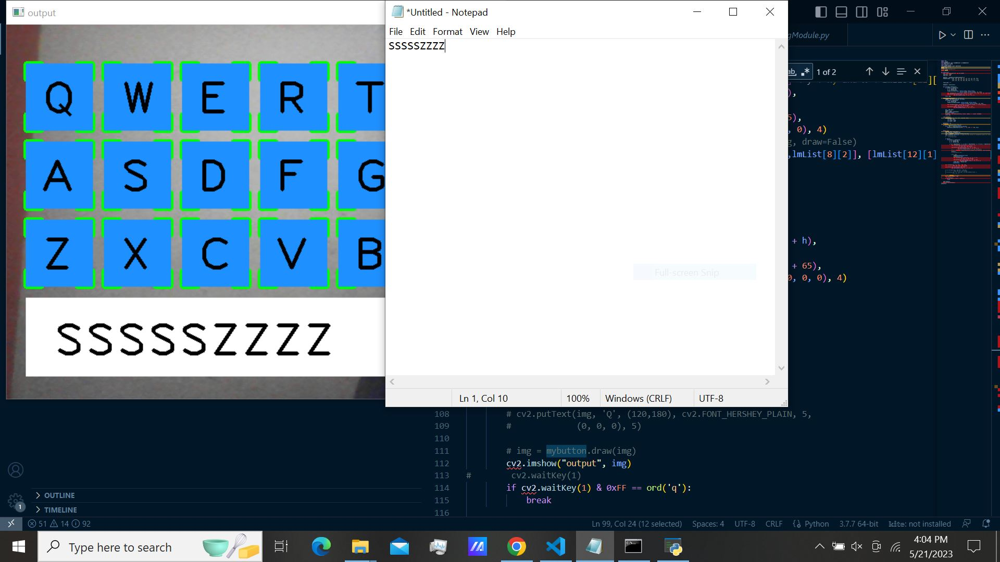

[![YouTube][youtube-shield]][youtube-url]
[![LinkedIn][linkedin-shield]][linkedin-url]
# Virtual Keyboard
This repository contains a virtual keyboard implementation using the OpenCV and MediaPipe libraries. The virtual keyboard utilizes computer vision techniques to track hand movements and recognize gestures or finger positions for simulating typing on a keyboard without physical keys.

[youtube-shield]: https://img.shields.io/badge/-youtube-black.svg?style=for-the-badge&logo=youtube&colorR=555
[youtube-url]: https://www.youtube.com/channel/UC8pztyZ8bYiflGMKGcLdAGw
[linkedin-shield]: https://img.shields.io/badge/-LinkedIn-black.svg?style=for-the-badge&logo=linkedin&colorB=555
[linkedin-url]:  https://linkedin.com/in/anil2kk
